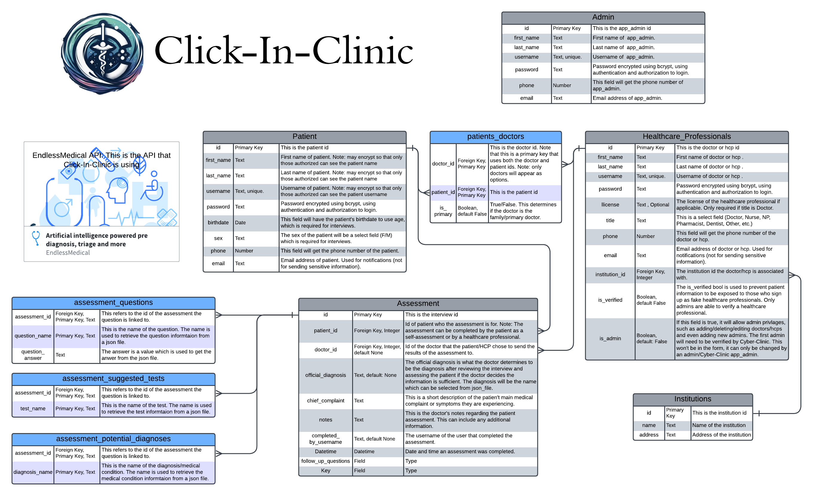

# [Click-In-Clinic](https://helbahu-github-io-1.onrender.com)

## Introduction

Click-In-Clinic is a website that allows patients to complete a medical assessment if they are experiencing any concerning signs/symptoms. Healthcare Professionals may also complete assessments for a patient. The completed assessments will be available for review by the chosen doctor. To put it simply, this is a medical assessments app.
This website uses [EndlessMedical API](https://endlessmedical.com/), which allows for users to submit the symptoms they are experiencing and returning with suggested additional questions, suggested test, and potential diagnoses. 

## Schema and Design

 

## Functionality
1. All Users
    - Users can create an account, edit their accounts, and delete their accounts.
    - Users can choose from different color themes in the settings.

2. Patients:
    - Complete assessments
    - Send assessments to their doctor of choice for review.
    - Receive follow-up instructions and questions from their doctor.
    - View all past assessments and see the doctor's review and notes.

3. Healthcare Professionals:
    - Complete assessments for patients.
    - View suggested tests based on the assessment
    - View potential diagnoses based on the assessment
    - Review assessments (Doctors Only): document notes, give any follow-up questions to the patient, and make an official diagnosis.
    - Admin Privlages (see Admins) only if given admin privlages by an Admin.

4. Admins
    - Can verify healthcare professionals. When a user signs up as a healthcare professional, an admin is responsible for verifying that the user is a healthcare professional. Healthcare professionals can be admins as well (when given permission), but they can only verify those in their Institution.
    - Can give admin privlages to Healthcare Professionals. Healthcare professional admins can give admin privlages to those in their institution.
    - Add and delete an institution.  
    - Delete Users. Healthcare professional admins can only delete users in their institution.

